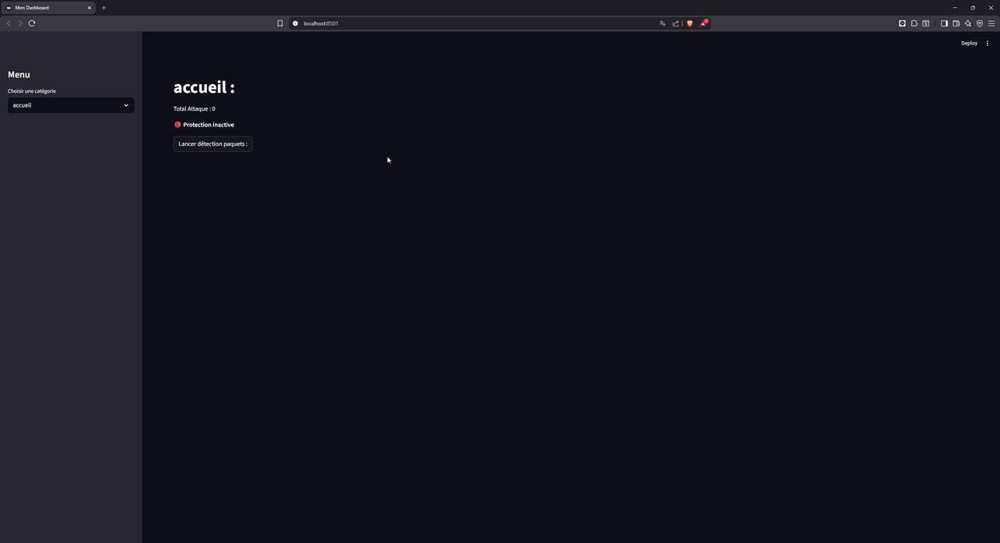
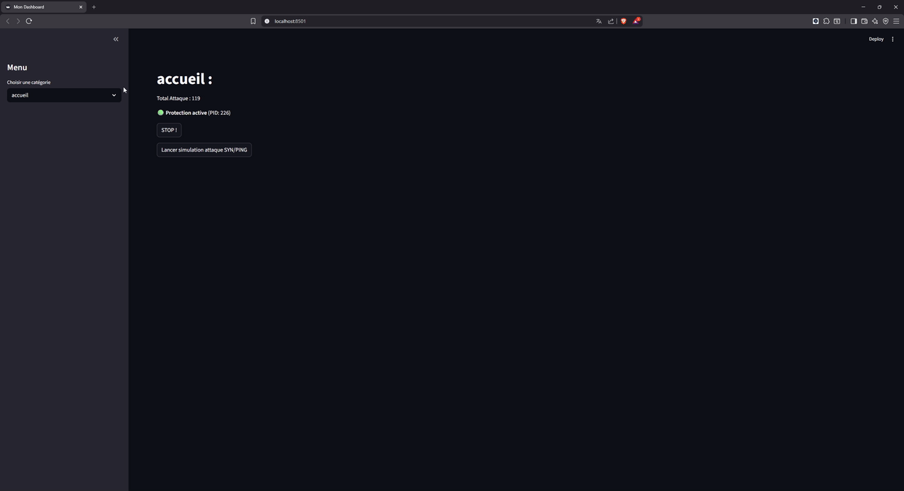

# NIDS - Network Intrusion Detection System

Système de détection d'intrusion réseau avec interface web interactive développé en Python.

## Démo

### Simulation d'attaque

*Démonstration du lancement d'une attaque SYN/PING simulée et détection en temps réel*

### Visualisation des résultats

*Navigation dans les logs, la blacklist et les graphiques de statistiques*

## Description

NIDS est un système de détection d'intrusion qui analyse le trafic réseau en temps réel pour identifier les menaces potentielles. Il détecte notamment :
- **Attaques SYN Flood** (scan de ports)
- **Attaques ICMP Flood** (ping flood)
- Bannissement automatique des IPs suspectes
- Notifications Discord en temps réel

## Fonctionnalités

- **Interface web Streamlit** : Tableau de bord interactif pour visualiser les alertes et gérer les blacklists
- **Détection en temps réel** : Capture et analyse des paquets réseau avec Scapy
- **Blacklist automatique** : Bannissement des IPs malveillantes
- **Logs détaillés** : Historique complet des attaques détectées
- **Graphiques interactifs** : Visualisation des types d'attaques avec Plotly
- **Simulation d'attaques** : Testez le système avec des attaques simulées
- **Notifications Discord** : Alertes en temps réel (configurable)

## Installation & Lancement

### Prérequis

- Python 3.10 ou supérieur
- Windows (avec droits administrateur pour la capture de paquets)
- Docker (optionnel)

### Installation locale

1. **Cloner le dépôt**
```bash
git clone https://github.com/MaximeSDP/NIDS.git
cd NIDS
```

2. **Installer les dépendances**
```bash
python -m pip install -r requirements.txt
```

3. **Lancer l'interface web**
```bash
python -m streamlit run interface/app.py
```

4. **Accéder à l'application**
   - Ouvrir votre navigateur sur : `http://localhost:8501`

### Lancement avec Docker

1. **Build l'image**
```bash
docker build -t nids-app .
```

2. **Lancer le container**
```bash
docker run -p 8501:8501 nids-app
```

3. **Accéder à l'application**
   - Ouvrir votre navigateur sur : `http://localhost:8501`

> ! **Note** : La capture de paquets nécessite des privilèges administrateur. Le NIDS fonctionne mieux en local qu'en Docker pour l'analyse réseau.

## Utilisation

1. **Lancer la détection** : Cliquez sur "Lancer détection paquets" dans l'interface
2. **Simuler une attaque** : Utilisez le bouton "Lancer simulation attaque SYN/PING" pour tester
3. **Consulter les logs** : Naviguez dans les menus "Fichier logs" et "Fichier BanIP"
4. **Visualiser les stats** : Section "Graphique" pour voir la répartition des attaques

## Structure du projet

```
NIDS/
├── interface/          # Interface web Streamlit
│   └── app.py
├── LayerAnalyst/       # Analyseurs de paquets réseau
│   ├── LayerAnalyzer.py
│   ├── SynFlagAnalyzer.py
│   ├── PingAnalyzer.py
│   └── __init__.py
├── Filter/             # Filtres de protocoles réseau
│   ├── filter.py
│   ├── ether.py
│   ├── tcp.py
│   ├── udp.py
│   ├── IP.py
│   └── __init__.py
├── utils/              # Gestionnaires (logs, blacklist, Discord)
│   ├── jsonManager.py
│   ├── logsManager.py
│   ├── blacklistManager.py
│   └── discordManager.py
├── memory/             # Compteurs d'activité IP
│   ├── IPActivityCounter.py
│   └── __init__.py
├── data/               # Fichiers JSON (logs, blacklist)
│   ├── logs.json
│   └── blacklist.json
├── Images/             # Assets pour le README
│   ├── gif1.gif
│   └── gif2.gif
├── main.py             # Point d'entrée du NIDS
├── attack_sim.py       # Simulateur d'attaques
├── test_managers.py    # Tests unitaires
├── requirements.txt    # Dépendances Python
├── Dockerfile          # Configuration Docker
├── nids.log            # Logs du NIDS (généré)
├── nids.err            # Erreurs du NIDS (généré)
└── README.md           # Documentation
```

## Configuration

### Webhooks Discord (optionnel)

Pour activer les notifications Discord, modifiez les URLs dans `utils/discordManager.py` :

```python
WEBHOOK_URLS = {
    "security": "YOUR_SECURITY_WEBHOOK_URL",
    "logs": "YOUR_LOGS_WEBHOOK_URL",
    "general": "YOUR_GENERAL_WEBHOOK_URL"
}
```


## Licence

Ce projet est distribué sous la licence **GNU Affero General Public License v3.0 (AGPL-3.0)**.

Vous êtes libre de :
- Utiliser le logiciel à des fins personnelles ou commerciales
- Modifier le code source
- Distribuer des copies

**Conditions** :
- Si vous utilisez ce logiciel sur un serveur réseau, vous **devez** fournir le code source aux utilisateurs
- Toute modification doit être distribuée sous la même licence AGPL-3.0
- Vous devez inclure l'avis de copyright et la licence

Voir le fichier [LICENSE](LICENSE) pour les détails complets.

## Auteur

MaximeSDP